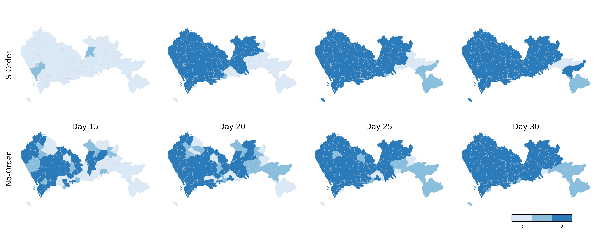
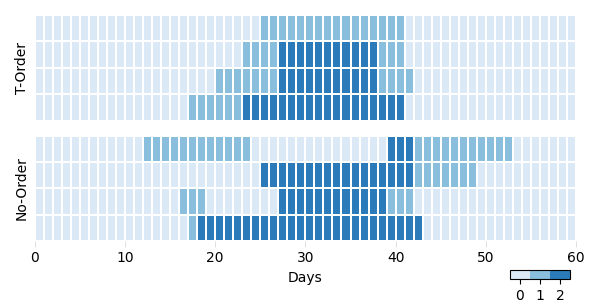

# DRL-based Epidemic Control Considering ST-Orderliness


[//]: # (## Contents)

[//]: # ()
[//]: # (- [Introduction]&#40;#Introduction&#41;)

[//]: # (- [Usages]&#40;#Usages&#41;)


## Introduction

A deep-reinforcement-learning-based (DRL) model to optimize the epidemic control strategies with a focus of considering the coordination of interventions in both spatial and temporal dimensions. 


## Usages

train the RL agent considering st-order from initial

```shell
python main.py --experiment_idx 1 --load_model False
```
train the RL agent considering no-order from a ckpt
```shell
python main.py --experiment_idx 4 --load_model True --model_idx 100 --lr_a 1e-5  --lr_c 1e-5
```

The values of "experiment_idx" 1, 2, 3, and 4 correspond to "st-order", "s-order", "t-order", and "no-order", respectively.

To test a trained model, follow these steps in the main.py file:

1. Comment out the call to main() on line 270.
2. Uncomment the call to my_test() on line 273.

After making these changes, run the main.py script to test the trained model.
```shell
python main.py --experiment_idx 1 --model_idx 200
```

### Note:
We are unable to publicly share the flow data required for this project. In order to ensure smooth execution and allow you to explore the functionality, you can generate a flow.npy file of size 74x74 on your own.

If you wish to conduct tests or experiments, we provide the following sample code to help you generate a synthetic flow.npy file:

```python
import numpy as np

# Generate a random 74x74 array
flow_data = np.random.random((74, 74))

# Normalize the rows to sum up to 1
flow_data_normalized = flow_data / np.sum(flow_data, axis=1, keepdims=True)

# Save it as flow.npy file
np.save('flow.npy', flow_data_normalized)
```
Please note that this is just an example, and the generated data is random.


## Visualization
We test the ckpt in the directories model1, model2, model3, and model4, and then visualize the actions taken by RL agent in both spatial and temporal dimensions

[//]: # (![]&#40;figs/fig6.png&#41;)

[//]: # (![]&#40;figs/fig7.png&#41;)
#### Spatial distribution of peak infections and control levels

#### Temporal distribution of control levels

